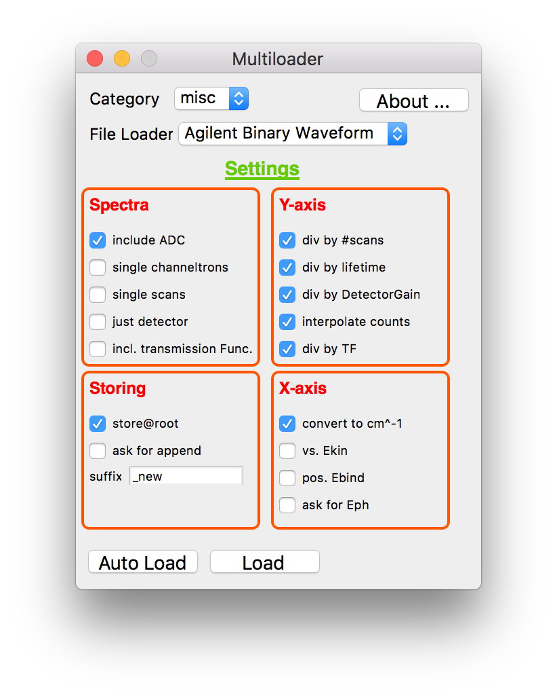

import tool for IgorPro
=======================

General import tool for IgorPro for importing various data file formats.

**Supported formats**:

  - Agilent Binary Waveform *.bin
  - BESSYII EMP *.dat
  - Canberra AccuSpec MCA *.mca
  - Canberra CNF *.cnf
  - ChiPlot *.chi
  - Createc *.dat
  - Crystallographic Binary Files *.cbf
  - DBWS *.dwb, *.rit, *.neu
  - EC-Lab raw *.mpr
  - EC-Lab text *.mpt
  - EXTECH ASCII log files *.txt
  - EXTECH BINARY log files *.AsmDat
  - FOURYA/XFIT/Koalariet *.xdd
  - Gwyddion 2.x *.gwy
  - Kratos Vision *.dset
  - LK-Tech AES *.dat
  - LK-Tech HREELS *.dat
  - Nanotec WSxM *.stp
  - NSLS beamline X15B *.dat
  - Omicron SCALA *.par
  - Phi Multipak *.spe
  - Philips RD raw scan *.rd, *.sd
  - Philips UDF *.udf
  - Princeton Instruments WinSpec *.spe
  - RIET7 *.dat, *.rit
  - Rigaku *.dat
  - SamView *.avg
  - Siemens/Bruker Diffrac-AT Raw *.raw
  - Siemens/Bruker Diffrac-AT UXD *.uxd
  - Sietronics Sieray CPI *.cpi
  - Spec ascan/a2scan *.csv
  - SpecsLab1 *.exp
  - SpecsLab2 *.xml and *.xy
  - Spectra *.#
  - SSRL ASCII EXAFS data *.dat
  - SSRL BINARY EXAFS data *.dat
  - SSRL µEXAFS data *.dat
  - UKSOFT2001 *.dat, *.dav
  - VAMAS *.vms
  - Veeco *.hdf
  - Veeco Nanoscope III *.#
  - VersaStudio data *.par
  - VG Scienta SES *.pxt, *.ibw, *.txt
  - WVASE32 *.dat
  - XAS Data Interchange *.xdi

**Installation**:

Copy the "Igor Procedures" folder to:
  - Mac OS X: 	``/Users/<user>/Documents/WaveMetrics/Igor Pro 6 User Files/``
  - Windows: 	``<My Documents>\WaveMetrics\Igor Pro 6 User Files\``

**Howto**:

There are several ways to use the file loader:
  - Use the multi file loader (macro menu) to change the flags and load multiple files at once
  - Call the procedures (``<name>_load_data()``) directly through the command window without parsing a parameter to load a single file
  - Call the procedures and parse an optional file ref (``<name>_load_data(optfile=<fileref>)``)
  - Use the auto detection of the file type via the multi loader

**Configuration**:

In order to change the behaviour of the import tool change the settings (importflags) in ``import_loader.ipf`` or use the multi-loader GUI.

**Requirements**:

The following routines depend on ZIP.XOP (http://www.igorexchange.com/project/ZIP) in order to fully work:
  - Createc *.dat (only v2Z)

**Authors**
  - Matthias Richter matthias.h.richter@gmail.com

**Credits**:
  - Parts of the procedures are based on xylib by Marcin Wojdyr
  - Jan Ilavsky (Crystallographic Binary Files)
